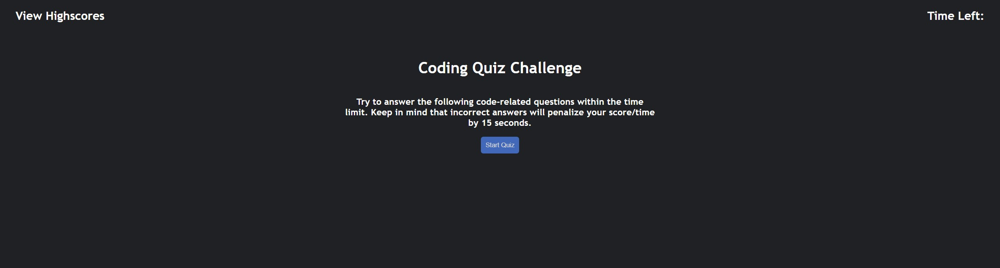

# 04-code-quiz
Bootcamp Challenge 4 - Web API Code Quiz 

On this challenge I created a JavaScript coding quiz from scratch.

The application has to include the following acceptance criteria:
```
GIVEN I am taking a code quiz
WHEN I click the start button
THEN a timer starts and I am presented with a question
WHEN I answer a question
THEN I am presented with another question
WHEN I answer a question incorrectly
THEN time is subtracted from the clock
WHEN all questions are answered or the timer reaches 0
THEN the game is over
WHEN the game is over
THEN I can save my initials and score
```

Here is a screenshot of what the application looks like:



Link to the deployed application:

https://diegoaborjas.github.io/04-code-quiz/